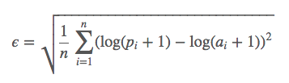

# Summary
This is the ridge regression model that my team and I built in 4 hours which was trained on over 1.1 million historical auction sale results, with over 50 product features, that enabled us to predict auction sale prices for heavy equipment 16.5% more accurately than the baseline predictor model.

# Methodology
The largest challenge of this project was the messy and sparse dataset. Therefore, we focused on engineering useful features and considering ways to deal with absent data. We determined that the following features were the most useful predictors:
- Equipment type
- Age
- Usage    

Given more time, we believe incorporating recent average prices by equipment type would also be a strong predictor of sale price.

`ridge_model.py` contains our error calculation, data processing pipeline, cross-validation and model training.

`run.py` and `score_model.py` are the code that were used to run and score our model.

# Results
The evaluation of our model was based on Root Mean Squared Log Error.
Which is computed as follows:

where *pi* are the predicted values and *ai* are the
target values.

Our final model predicted prices on held-out data 16.5% more accurately than the baseline weighted-average predictor model based on room mean squared log error.

# Restrictions
The following techniques were legal

  - Linear Regression.
  - Logistic Regression.
  - Median Regression (linear regression by minimizing the sum of absolute deviations).
  - Any other [GLM](http://statsmodels.sourceforge.net/devel/glm.html).
  - Regularization: Ridge and LASSO.
